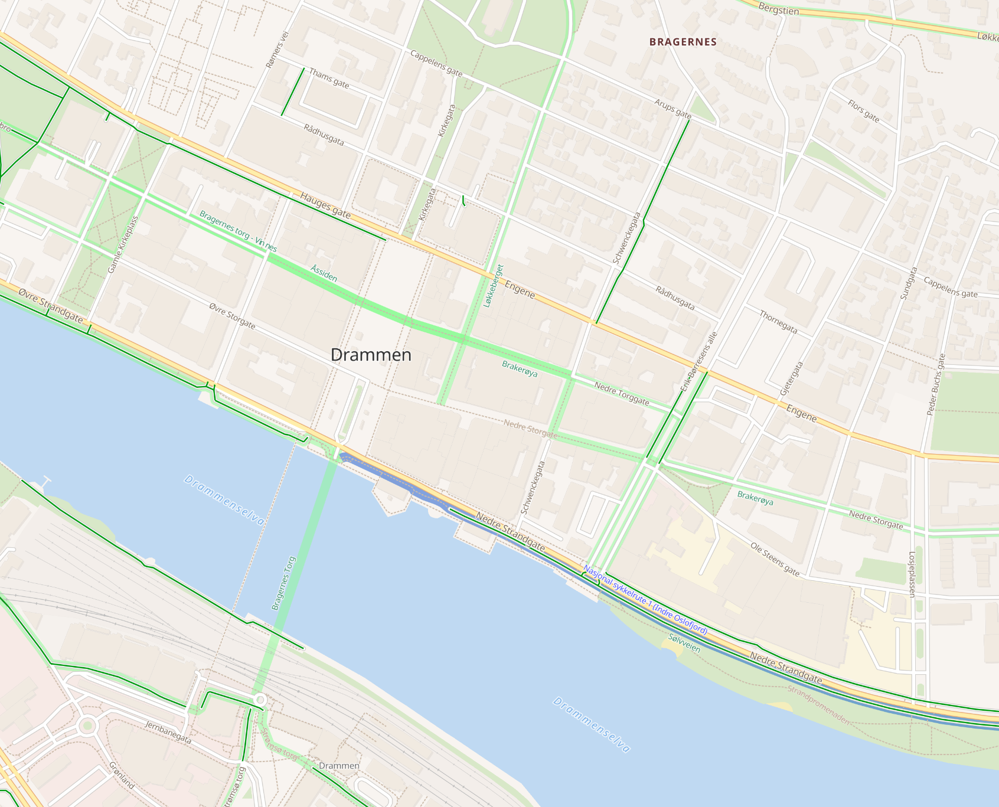

# OSM Cyclo Bright

A Mapbox GL basemap style showcasing OpenStreetMap data for cyclists.
It is using the vector tile schema of [OpenMapTiles](https://github.com/openmaptiles/openmaptiles).

## Preview



## Start a local tileserver

Build the style, create vector tiles and start a web-server with a self-signed certificate:

```shell
make
```

Visit https://localhost to see a map with the Cyclo Bright style.

Afterwards, the tileserver can be stopped with:

```shell
make stop-tileserver
```

## Edit the Style

### Local installation

Use the [Maputnik CLI](http://openmaptiles.org/docs/style/maputnik/) to edit and develop the style.
After you've started Maputnik open the editor on `localhost:8000`.

```
maputnik --watch --file style.json
```

### Docker

Alternatively, [start Maputnik as docker container](https://github.com/maputnik/editor#usage) and upload [style.json](style.json) from the web interface.

```shell
sudo docker run -it --rm -p 8888:8888 maputnik/editor
```
