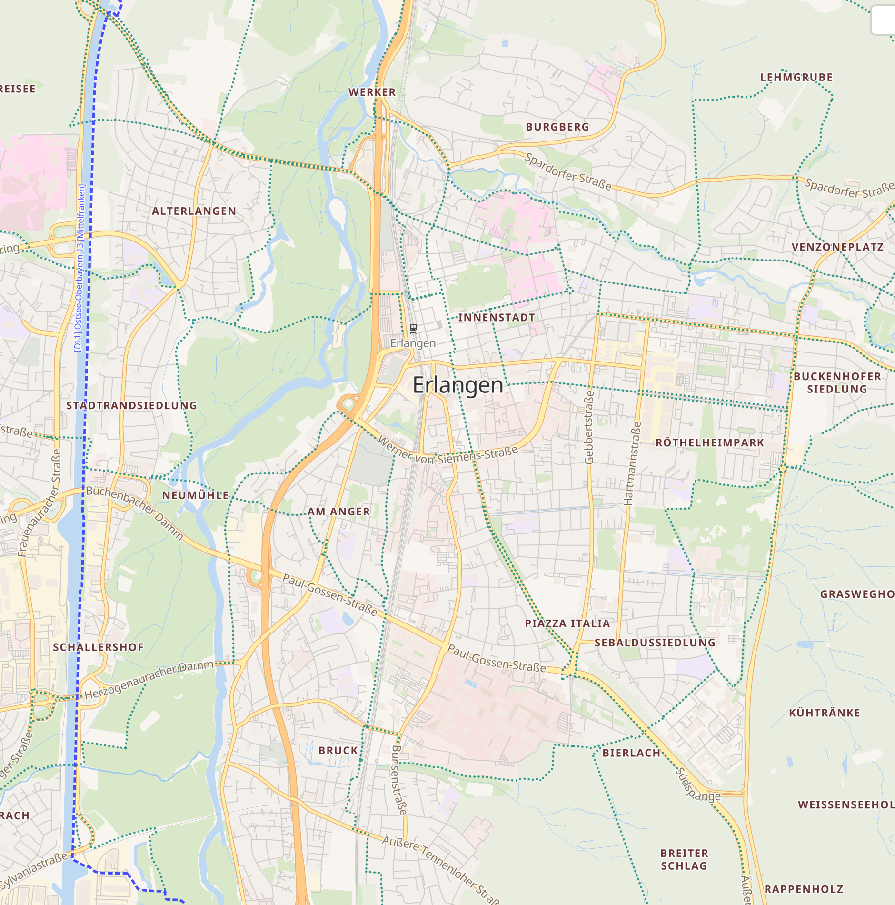
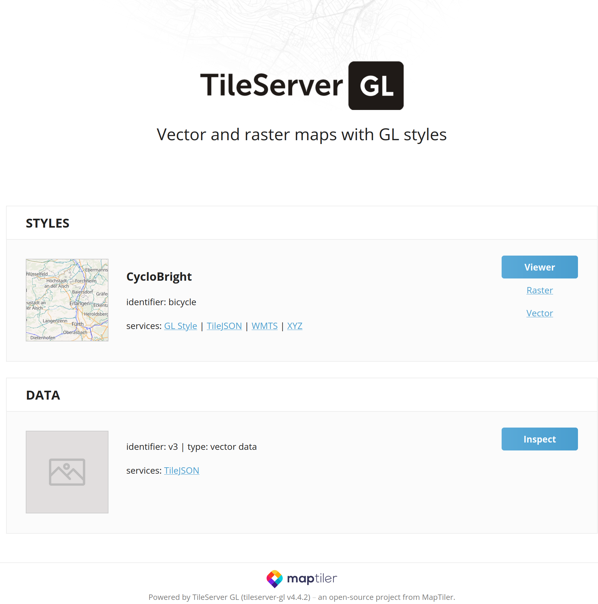

# OSM Cyclo Bright

A Mapbox GL basemap style showcasing OpenStreetMap data for cyclists.
It is using the vector tile schema of [OpenMapTiles](https://github.com/openmaptiles/openmaptiles).



## Static vector tiles

Build the style, create static vector tiles and start nginx as web server behind a reverse-proxy with a self-signed certificate:

```shell
make start-static-tileserver
```

Visit https://localhost to see a map with the OSM Cyclo Bright style.

Afterwards, the tileserver can be stopped with:

```shell
make stop
```

## Vector and raster tiles

Build the style, create a single .mbtiles file and start mapbox-gl as server behind a reverse-proxy with a self-signed certificate:

```shell
make start-tileserver-gl
```

Visit https://localhost to see the TileServer GL overview page which redirects to raster and vector map previews. The raster tile map is less sharp and does not provide smooth zooming, but it can be viewed on webbrowsers without WebGL support.



Afterwards, the tileserver can be stopped with:

```shell
make stop
```

## Configuration

To create the tiles for a different region, one can either adjust the variables at the head of the [Makefile](Makefile) or override them as shown in the following.

Example for the city Oulu, Finnland:

```shell
# Vector and raster tiles
make \
  NAME=oulu \
  REGION=europe/finland \
  MIN_LON=24.37 \
  MAX_LON=26.61 \
  MIN_LAT=64.71 \
  MAX_LAT=65.38 \
  start-tileserver-gl
```

Visit https://localhost

```shell
# Static vector tiles
make \
  NAME=oulu \
  REGION=europe/finland \
  MIN_LON=24.37 \
  MAX_LON=26.61 \
  MIN_LAT=64.71 \
  MAX_LAT=65.38 \
  start-static-tileserver
```

Visit https://localhost/styles/bicycle/#12.1/65.01029/25.47406

## Edit the Style

### Local Maputnik installation

Use the [Maputnik CLI](http://openmaptiles.org/docs/style/maputnik/) to edit and develop the style.

```
make style.json
maputnik --watch --file style.json
```

After you've started Maputnik open the editor on http://localhost:8000.

### Maputnik Docker container

Alternatively, [start Maputnik as Docker container](https://github.com/maputnik/editor#usage) and upload [style.json](style.json) from the web interface.

```shell
make style.json
sudo docker run -it --rm -p 8888:8888 maputnik/editor
```

After you've started Maputnik open the editor on http://localhost:8888.
